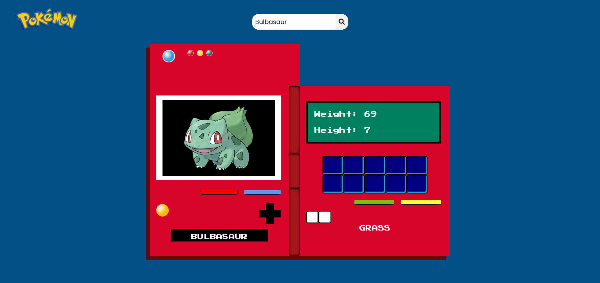
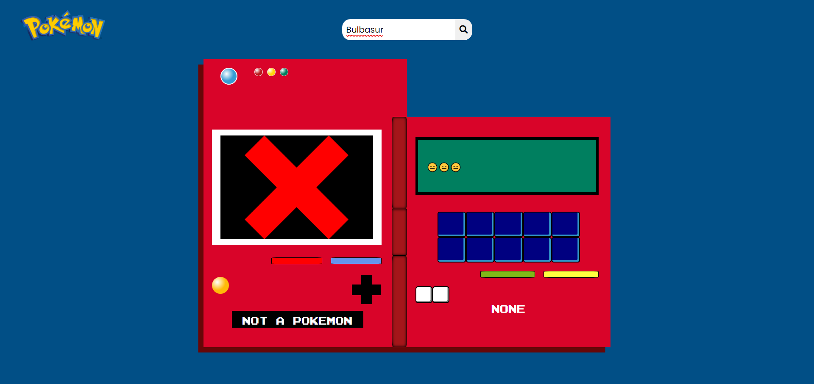

# Month 3
## Week 3
This week's task was to build a task which uses any sort of API. I'd use a Pokemon related API. What my task does is it fetches the info related to the pokemon searched.

Here are the images of my task

## 
## 