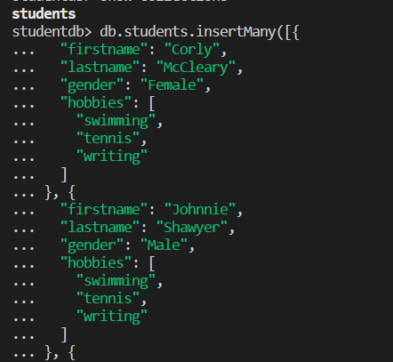
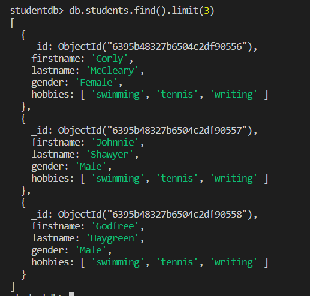
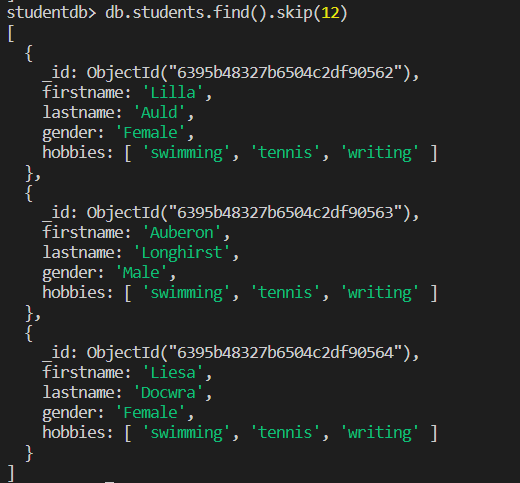
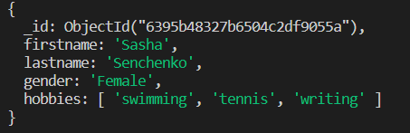
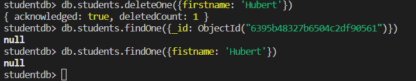
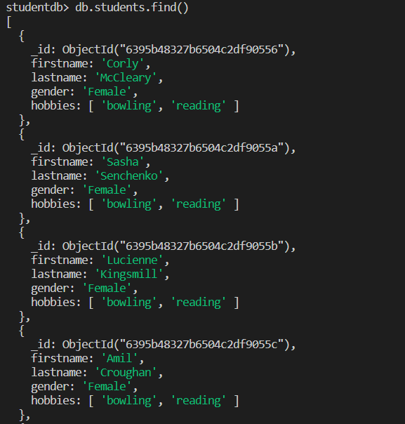
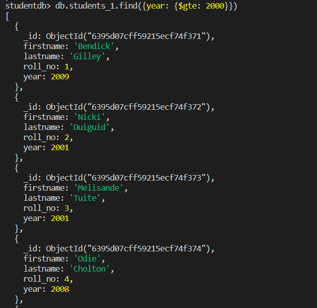
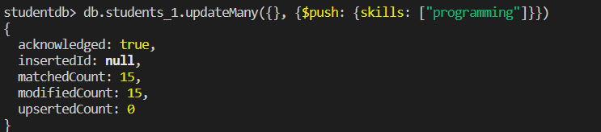
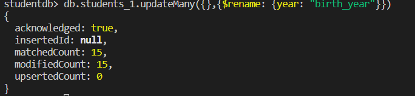

# Week 2
For this's week task we are learning MongoDB

First of all install you need to install [MongoDB](https://www.mongodb.com/docs/manual/installation/) and [Mongosh](https://www.mongodb.com/docs/manual/installation/) on your system. For further setup you can refer to documentation.

For learning the MongoDB commands I have used fake data from generated from this [site](https://www.mockaroo.com/). You can find the data used by me in JSON format [here](./assets/MOCK_DATA.json). 

## Let's get started

Type the following commands in your preferred CLI
```
mongosh
```
```
use <dbname>
```
```
db.createCollection("myCollection")
```
To confirm you can use the command
```
show collections
```
Now we can use various sorts of commands offered by MongoDB

**I have used studentdb as my db name and students as my collection name**
### Create Command
To add data to database we can use **insertOne** **insertMany** commands
```
db.students.insertMany(array of objects)
```

### Filter Commands
To get all the data use command
```
db.students.find()
```

To get specific number of objects
```
db.users.find().limit(3)
```

To skip specific number of objects from top use
```
db.students.find().skip(12)
```

To get your data sorted alphabetically for a particular property 
```
 db.students.find().sort({firstname: 1})
```

### Update Commands
To update the first document that matches the given data passed
```
db.students.updateOne({firstname:'Masha'},{$set: {firstname: 'Sasha'}})
```


To update all the document that matches the given data passed
```
db.students.updateMany({ hobbies: [ 'swimming', 'tennis', 'writing' ]}, {$set: {hobbies: ['bowling','reading']}})
```

### Delete Commands
To delete the first document that matches the given data passed
``` 
db.students.deleteOne({firstname: 'Hubert'})
```


To delte all the document that matches the given data passed
```
db.students.deleteMany({gender: "Male"})
```


To exit the mongosh session use the command ```exit```

---

While the commands were basic, MongoDB gives you commands to make complex queries

So let's make another collection to see them, you can get it [here](./assets/MOCK_DATA_1.json)

### Filter Complex Queries

To check for greater than or equal to
```
db.students_1.find({year: {$gte: 2000}})
```


MongoDB offers ton of other commands for filtering like ```$eq```,```$ne```,```$lt/$lte```,```$in```,```$nin```,```$and```,```$or```,etc

### Update Comples Queries

To add a property in array for all Objects
```
db.students_1.updateMany({}, {$push: {skills: ["programming"]}})
```



To rename a propert name in array for all Objects
```
db.students_1.updateMany({},{$rename: {year: "birth_year"}})
```

MongoDB offers ton of other commands for updating like ```$set```,```$inc```,```$unset```,```$pull``` and they can be customized with both updateOne and updateMany.

### Some other basic commands
to delete your current database
```
db.dropDatabase()
```

to clear you terminal screen
```
cls
```